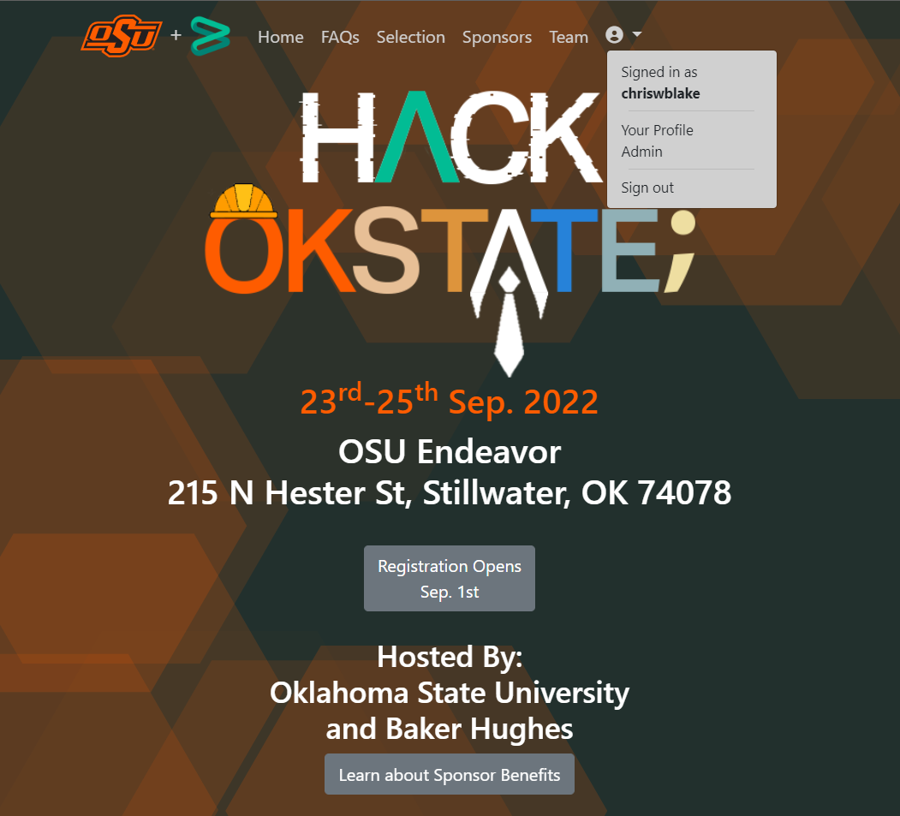

# Hackathon WebApp, OSU + Baker Hughes
The hackathon web application is the main organization component of the partnered event betweeen Oklahoma State University and Baker Hughes Inc. This event usually happens in September. The WebApp is used to organizer sponsors, registration, team assignment, and project voting.

### Students
Before the event, OSU students are able to visit the site and apply to the hackathon.
At the end of the event, OSU students are able to vote on the other projects.

### Judges
At the end of the event, judges are able to vote on the projects.

### Organizers
Can define event settings via an admin area, such as start dates, sponsors, team placement, judges, organizer profiles, etc.


### Screenshots


<!-- |Leaderboard|My Team|Certificate|
|:--:|:--:|:--:|
|||| -->

# Architecture
This web application uses MVC (Model, View, Controller) architecture for serving pages, includes Bootstrap for mobile interfaces, and some basic coloring to match Baker Hughes and OSU branding.

Since the application is still young, some features are still hard-coded, but this is in transition. Important notes that may not be obvious:

- Unit testing is sparse. It is only present for difficult process like the team placement algorithm.
    - Please consider the cascade of any changes to existing functions.
- A MongoDB NoSQL database is used for storing most user, team, sponsor, and event settings. This is a work in progress.
- The architecture is being shifted to support multiple events, so past events can still be highlighted.

# Configuration
Deployment settings are configured via environment variables. After that, all other settings for the appliction features, events, users, voting, etc. are managed via the web interface.

## ENV: Database + Emails
The registered users, teams, sponsors and other event data are all stored in a MongoDB NoSQL database.
Emails during registration are sent via google's email service. 

The connection string, collection names, and email credentials must be defined via environment variables. 
During development this is provided via the file `develop.env`.
> There is also an option for `prod.env` for running the local app against the production database, but that should be avoided.

Example: develop.env
```
MONGODB_URL=mongodb+srv://user-dev:pass@<datbasename>.mongodb.net
MONGODB_IDENTITY_DB_NAME=<user collection name>
MONGODB_HACKATHON_DB_NAME=<events collection name>
EMAIL_USERNAME=<email address>
EMAIL_PASSWORD=<email password>
RECAPTCHA_KEY=<private key from google recaptcha service>
```

## Application Configuration


### How to become Admin
The first account is automatically assigned as an admin.

1. Start the web application service.
1. Navigate to the home page. 
    - If locally, something like: http://localhost:5001
    - The exact URL will be listed in the terminal after it has started.
1. In the top right, click `Sign In`.
1. Underneath the login area, click the link for `Create an Account`.
1. Fill in the required information and click `Create`.


### How to change settings
The application settings are only available to admin accounts.

1. If necessary, sign in to the web application using a known admin account.
1. On the home page, find the user icon in the top right. Click it to reveal the menu.
1. On the user menu, near the bottom, find the `Admin` option, and click it. This will navigate to the backend configuration settings area.

# Developer Notes

### Prerequisites
- [.Net SDK for VS Code, v3.1+](https://dotnet.microsoft.com/en-us/download/dotnet/3.1)
- [Visual Studio Code](https://code.visualstudio.com/)
- [VS Code Extension: C#](https://marketplace.visualstudio.com/items?itemName=ms-dotnettools.csharp)
- [VS Code Extension: .NET Core Test Explorer](https://marketplace.visualstudio.com/items?itemName=formulahendry.dotnet-test-explorer)
- [MongoDB Database](https://www.mongodb.com/) - Locally for development, something in the cloud for production.
    > For simplicity, we use MongoDB Atlas with a free tier.


## How to verify compatible dotnet version
When working locally, you may have several runtimes installed.  Run the following terminal command to list all available SDKs and runtimes.
```bash
dotnet --info
```

The result will looks something like the below.
If `3.1.x` is listed, the application should run as expected.
```
...

.NET SDKs installed:
  2.1.202 [/usr/local/share/dotnet/sdk]
  3.1.425 [/usr/local/share/dotnet/sdk]
  3.1.426 [/usr/local/share/dotnet/sdk]
  6.0.404 [/usr/local/share/dotnet/sdk]

.NET runtimes installed:
  Microsoft.AspNetCore.App 3.1.31 [/usr/local/share/dotnet/shared/Microsoft.AspNetCore.App]
  Microsoft.AspNetCore.App 3.1.32 [/usr/local/share/dotnet/shared/Microsoft.AspNetCore.App]
  Microsoft.AspNetCore.App 6.0.12 [/usr/local/share/dotnet/shared/Microsoft.AspNetCore.App]
  Microsoft.NETCore.App 2.0.9 [/usr/local/share/dotnet/shared/Microsoft.NETCore.App]
  Microsoft.NETCore.App 3.1.31 [/usr/local/share/dotnet/shared/Microsoft.NETCore.App]
  Microsoft.NETCore.App 3.1.32 [/usr/local/share/dotnet/shared/Microsoft.NETCore.App]
  Microsoft.NETCore.App 6.0.12 [/usr/local/share/dotnet/shared/Microsoft.NETCore.App]

...
```

## How to Run Locally
1. Ensure the above prerequisites are installed/ready.
    > Installation of DotNet may require restarting your computer for `dotnet` to be recognized in `PATH`.  
    > Note: **Warning -** If using a cloud database, connection may fail if running behind a proxy, VPN, or other restricted network.
2. Clone this repository to your local machine.
3. Create or update `develop.env` 
    - See above Configuration sections for required environment variables.
4. After opening this project, give VS Code some time to install any extensions and dotnet some time to restore the packages.
5. In VS Code, select the debugging tab. Select `Launch (dev)` and click the **Run** button (or press `F5`) to launch.
    > These settings are preconfigured in the `.vscode` folder.  
    > The first launch may take a moment while packages are downloaded. Status can be viewed from the debug console.
6. The web server will launch in the background. The page can be viewed by opening http://localhost:5001.


## How to Deploy
This web application is hosted on Azure using an app service.
<!--
It is deployed using Continue Deployment (CD). These workflows are in `.github/workflows/`.
There are 2 stages.
- Staging: The `develop` branch
- Production The `main` branch
-->
1. Ensure that an app service is available on Azure.
2. Configure the environment variables on the app service. (See **Configuration** section above.)
    - In Azure: `(Web App) --> All Settings --> Application Settings`
<!-- 3. Deploy manually using the VS Code Azure tools, or using CD. -->


